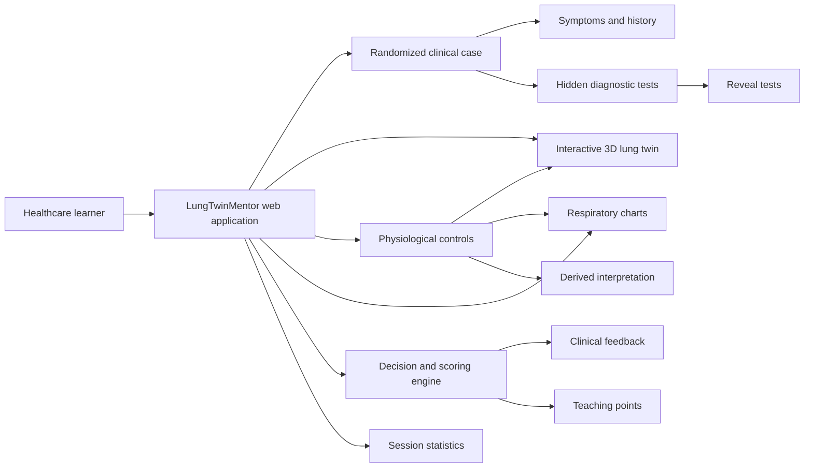

<div align="center">

# 🫁 LungTwinMentor

### Interactive 3D respiratory simulation for clinical decision training

A browser-based educational simulator that helps healthcare learners explore respiratory physiology, interpret clinical patterns, and practise acute decision-making through an interactive lung digital twin.

<br>


<br>

**Explore physiology. Interpret the pattern. Make a decision. Learn from feedback.**

</div>

---

## ✨ Overview

**LungTwinMentor** is a self-contained web application designed for respiratory education and clinical training.

The simulator combines a dynamic **3D lung digital twin**, interactive physiological controls, fictional clinical cases, diagnostic decision-making, immediate management selection, automatic scoring, educational feedback, and session tracking.

Learners can modify respiratory parameters in real time and observe how obstruction, restriction, hypoxemia, hypercapnia, altered compliance, and ventilation/perfusion mismatch affect the visual and physiological model.

> [!IMPORTANT]
> LungTwinMentor is an educational prototype. It is not a medical device, diagnostic system, validated respiratory mechanics model, or substitute for professional judgement and institutional protocols.

---

## 🎯 Project Goals

LungTwinMentor aims to provide a safe and repeatable environment in which healthcare learners can:

- understand fundamental respiratory physiology;
- explore the relationship between ventilation, perfusion, compliance, and airway resistance;
- recognise obstructive, restrictive, infectious, thromboembolic, and hypoxemic patterns;
- interpret FEV1, FVC, FEV1/FVC, peak expiratory flow, SpO₂, PaO₂, PaCO₂, and V/Q ratio;
- practise the initial assessment of acute respiratory presentations;
- select an appropriate diagnosis and immediate management strategy;
- identify missing investigations or escalation steps;
- review decisions through structured feedback and teaching points;
- compare clinical scenarios through interactive visualization.

---

## 🚀 Key Features

### 🫁 Interactive 3D Lung Twin

The application renders a rotatable respiratory model using **Three.js**.

The visualization includes:

- left and right lungs;
- trachea;
- main bronchi;
- simplified bronchial branches;
- alveoli;
- diaphragm;
- consolidation regions;
- V/Q mismatch regions;
- animated inspired-air particles;
- simulated carbon-dioxide particles;
- interactive anatomical labels.

The 3D model changes dynamically according to the active respiratory parameters.

### 🌬️ Dynamic Breathing Animation

Breathing motion is generated from the simulated respiratory rate, tidal volume, airway resistance, compliance, and obstructive pattern.

The model visually represents:

- inspiratory and expiratory phases;
- delayed expiration;
- reduced lung expansion;
- low-compliance ventilation;
- hyperinflation and air trapping;
- increased work of breathing;
- impaired airflow.

### 🧪 Interactive Physiological Controls

Learners can manually modify:

| Parameter | Educational purpose |
|---|---|
| Respiratory rate | Changes breathing frequency and minute ventilation |
| Tidal volume | Changes the amount of air moved per breath |
| FEV1 | Supports airflow-obstruction interpretation |
| FVC | Supports volume and restriction interpretation |
| Peak expiratory flow | Represents expiratory flow limitation |
| Airway resistance | Simulates bronchoconstriction or obstruction |
| Compliance | Simulates easy or difficult lung expansion |
| SpO₂ | Represents peripheral oxygen saturation |
| PaO₂ | Represents arterial oxygenation |
| PaCO₂ | Represents ventilation and carbon-dioxide retention |
| V/Q ratio | Represents ventilation/perfusion matching |

All values update the visualization, interpretation panel, charts, and derived metrics in real time.

### ⚙️ Respiratory Scenario Presets

The simulator includes configurable physiological presets for:

- normal respiratory physiology;
- asthma and bronchoconstriction;
- COPD and air trapping;
- restrictive disease;
- pneumonia and consolidation;
- pulmonary embolism and high V/Q mismatch;
- ARDS and severe low-compliance failure.

Presets automatically configure the physiological model while still allowing manual adjustment.

### 🚨 Seven Built-in Clinical Cases

The current prototype includes seven randomized educational cases:

| ID | Clinical scenario |
|---|---|
| LTM-001 | Acute asthma exacerbation after allergen exposure |
| LTM-002 | COPD exacerbation with hypercapnic risk |
| LTM-003 | Community-acquired pneumonia with hypoxemia |
| LTM-004 | Pulmonary embolism after prolonged immobilization |
| LTM-005 | ARDS-like respiratory failure after sepsis |
| LTM-006 | Restrictive physiology compatible with interstitial lung disease |
| LTM-007 | Normal respiratory physiology after an anxiety episode |

Patient age and physiological variables receive small randomized variations while preserving the underlying clinical pattern.

### 🧠 Clinical Decision Panel

For each case, the learner selects:

- a primary diagnosis;
- an immediate management strategy;
- relevant supportive actions and investigations.

Available decisions cover:

- observation and outpatient follow-up;
- bronchodilators and systemic corticosteroids;
- controlled oxygen and non-invasive ventilation;
- antibiotics and infection assessment;
- pulmonary embolism investigation and anticoagulation pathway;
- ICU escalation and ARDS management;
- restrictive-disease workup and pulmonary rehabilitation;
- emergency decompression for pneumothorax.

### 🔬 Diagnostic and Support Actions

Learners can select actions involving:

- oxygenation assessment;
- arterial blood gas analysis;
- chest radiography;
- bedside ultrasound;
- peak expiratory flow;
- spirometry;
- infection workup;
- D-dimer;
- CT pulmonary angiography;
- ICU and ventilatory-support escalation.

### 📈 Safety-Aware Feedback

The scoring engine evaluates:

- diagnostic accuracy;
- immediate-management selection;
- appropriate investigations;
- supportive actions;
- dangerous under-treatment;
- missed escalation;
- missed oxygenation assessment.

After submission, the learner receives:

- a score from 0 to 100;
- correct, partial, missing, and unsafe decision tags;
- the expected diagnosis;
- the expected management strategy;
- a simulated model classification;
- simulated confidence;
- case-specific teaching points.

### 📊 Real-Time Derived Values

The application calculates and displays:

- FEV1/FVC ratio;
- minute ventilation;
- estimated work of breathing;
- oxygenation category;
- obstructive pattern;
- restrictive pattern;
- V/Q mismatch;
- hypoxemia;
- hypercapnia.

These values are educational approximations rather than validated clinical calculations.

### 📉 Interactive Respiratory Charts

The simulator includes a live chart area displaying:

- a volume-time breathing curve;
- respiratory rate;
- tidal volume;
- FEV1/FVC ratio;
- a simplified flow-volume loop.

The curves respond immediately to changes in obstruction, compliance, respiratory rate, and tidal volume.

### 🏷️ Anatomical Labels and Visual Legend

The learner can enable or disable:

- alveolar visualization;
- anatomical labels.

The interface also includes a visual legend for:

- inspired air;
- oxygen exchange;
- obstruction and high resistance;
- V/Q mismatch;
- stiff or consolidated regions.

### 📊 Session Tracking

The session panel records:

- number of completed cases;
- average score;
- number of correct diagnoses.

---

## 🧩 How It Works



---

## 🛠️ Technology Stack

| Layer | Technology |
|---|---|
| Interface | HTML5 |
| Styling | CSS3 |
| Application logic | Vanilla JavaScript |
| JavaScript module system | ES modules |
| 3D rendering | Three.js 0.160.0 |
| Camera interaction | OrbitControls |
| Charts | HTML Canvas API |
| Responsive layout | CSS Grid and media queries |
| Deployment | Static web hosting or local HTTP server |

The current prototype does not require a frontend framework or build process.

---

## ⚡ Quick Start

### 1. Clone the repository

```bash
git clone https://github.com/YOUR-USERNAME/LungTwinMentor.git
cd LungTwinMentor
```

### 2. Start a local web server

Because the application uses JavaScript modules, it should be opened through an HTTP server rather than directly from the file system.

Using Python:

```bash
python -m http.server 8080
```

Using Node.js:

```bash
npx serve .
```

### 3. Open the simulator

Navigate to:

```text
http://localhost:8080/LungTwinMentor.html
```

---

## 🎮 Simulation Workflow

1. Generate a new randomized clinical case.
2. Review the symptoms, medical history, vital signs, and visible physiology.
3. Explore the animated 3D lung twin.
4. Interpret the respiratory parameters and live charts.
5. Reveal additional tests when needed.
6. Select the primary diagnosis.
7. Choose the immediate management strategy.
8. Select relevant investigations and support actions.
9. Submit the decision.
10. Review the score, safety warnings, expected answer, and teaching points.
11. Continue with another case and monitor session performance.

---

## 🧬 Adding a New Clinical Case

Clinical cases are stored in the `CASES` array.

A simplified case object follows this structure:

```javascript
{
  id: "LTM-008",
  title: "New respiratory training scenario",

  scenario: "asthma",
  diagnosis: "asthma",
  management: ["bronchodilator_steroids"],

  age: 45,
  sex: "Female",

  vitals:
    "RR 24/min · HR 110/min · SpO₂ 91% on room air · BP 130/80",

  symptoms:
    "Clinical presentation shown to the learner.",

  history:
    "Relevant medical history and risk factors.",

  tests:
    "Additional investigations revealed on request.",

  expectedActions: {
    oxygen: true,
    cxr: false,
    spiro: true,
    infection: false,
    ctpa: false,
    icu: false
  },

  aiClass:
    "Educational model classification",

  confidence: 0.90,

  pearls: [
    "First teaching point.",
    "Second teaching point.",
    "Third teaching point."
  ]
}
```

All cases should use fictional, anonymized, or appropriately authorized data.

---

## ⚙️ Adding or Modifying a Physiological Preset

Scenario presets are stored in the `presets` object:

```javascript
const presets = {
  example: {
    rr: 24,
    vt: 400,
    fev1: 1.8,
    fvc: 3.5,
    pef: 280,
    resistance: 70,
    compliance: 55,
    spo2: 92,
    pao2: 68,
    paco2: 44,
    vq: 0.7
  }
};
```

A new preset should also be added to:

- the scenario selector;
- `scenarioLabels`;
- the clinical-case database when applicable;
- the 3D visual rules if a new visual pattern is required.

---

## 🧮 Educational Model Logic

The simulator derives several respiratory interpretations from the selected values.

### FEV1/FVC ratio

```javascript
const ratio = state.fev1 / Math.max(state.fvc, 0.1);
```

A reduced ratio contributes to the obstructive-pattern interpretation.

### Minute ventilation

```javascript
const minuteVentilation =
  state.rr * state.vt / 1000;
```

The displayed value is expressed in litres per minute.

### Simplified pattern detection

The prototype uses educational threshold logic to identify:

- obstruction;
- restriction;
- hypoxemia;
- hypercapnia;
- V/Q mismatch;
- increased work of breathing.

These thresholds are intended for interactive teaching and must not be interpreted as validated diagnostic rules.

---

## 🎨 Customization

### Change the visual theme

Edit the CSS variables in `:root`:

```css
:root {
  --panel: rgba(8, 16, 32, 0.88);
  --panel2: rgba(15, 23, 42, 0.78);
  --text: #e5e7eb;
  --muted: #94a3b8;
  --cyan: #67e8f9;
  --ok: #86efac;
  --warn: #fbbf24;
  --bad: #fb7185;
  --violet: #a78bfa;
}
```

### Change the default physiological values

Update the `state` object:

```javascript
const state = {
  scenario: "normal",
  rr: 14,
  vt: 500,
  fev1: 3.2,
  fvc: 4.0,
  pef: 500,
  resistance: 20,
  compliance: 70,
  spo2: 98,
  pao2: 95,
  paco2: 40,
  vq: 0.8,
  alveoli: true,
  labels: true
};
```

### Change scoring rules

The main clinical-evaluation logic is implemented in:

```javascript
checkDecision()
```

### Change respiratory interpretation

The simplified interpretation logic is implemented in:

```javascript
derived()
updateInterpretation()
```

### Change the 3D behaviour

The main visual update logic is implemented in:

```javascript
syncVisuals()
```

---

## 🗂️ Current Project Structure

The prototype is currently delivered as a self-contained HTML application:

```text
LungTwinMentor/
├── LungTwinMentor.html
└── README.md
```

---

## 🔐 Privacy, Security, and Clinical Safety

Before deploying LungTwinMentor beyond a local educational prototype:

- use fictional or properly anonymized patient data;
- avoid storing identifiable health information;
- validate all new clinical scenarios;
- clearly separate educational content from medical advice;
- involve qualified respiratory professionals in content review;
- test clinical scoring for unsafe recommendations;
- maintain visible warnings and educational limitations;
- use HTTPS when hosted online;
- review accessibility and usability;
- comply with applicable privacy, research, and medical-device requirements;
- validate content against current guidelines and local protocols.

---


## 🧭 Potential Future Cases

Possible future scenarios include:

- cardiogenic pulmonary edema;
- tension pneumothorax;
- pleural effusion;
- acute bronchitis;
- severe obstructive sleep apnea;
- pulmonary hypertension;
- bronchiectasis;
- aspiration pneumonia;
- respiratory muscle weakness;
- ventilator-associated complications;
- mixed obstructive-restrictive disease;
- acid-base and arterial blood gas cases.

---

## 🤝 Contributing

Contributions are welcome, especially in:

- pulmonology;
- respiratory therapy;
- emergency medicine;
- critical care;
- medical education;
- respiratory physiology;
- 3D visualization;
- accessibility;
- web development;
- simulation-based learning.

Suggested workflow:

```bash
git checkout -b feature/your-feature
git commit -m "Add: your feature"
git push origin feature/your-feature
```

Then open a pull request describing:

- the problem addressed;
- the proposed change;
- testing performed;
- clinical or physiological assumptions;
- screenshots when the interface changes;
- references supporting clinical-content changes.

Clinical contributions should be reviewed by qualified professionals before being merged.

---

## 📚 Citation


---

## ⚖️ Disclaimer

LungTwinMentor is intended exclusively for education, simulation, and research.

It must not be used to:

- diagnose a real patient;
- select treatment for a real patient;
- replace emergency assessment;
- replace local clinical protocols;
- replace qualified medical judgement;
- delay emergency care.

For real clinical situations, follow validated guidelines, institutional procedures, and the decisions of qualified healthcare professionals.

---

## 📄 License


---

## 👥 Authors and Contact

**Project:** LungTwinMentor  
**Field:** Digital twins, respiratory simulation, medical education, and interactive physiology  
**Institution:** ``  
**Contact:** `frdiaz@unex.es`

---

<div align="center">

### 🫁 Visualize physiology. Practise decisions. Learn without putting patients at risk.

**LungTwinMentor**

</div>
